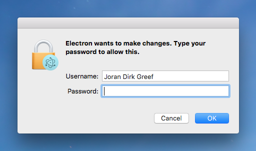
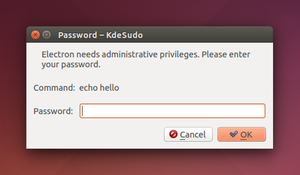
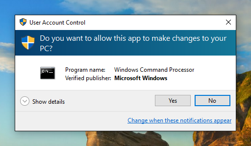

# exec-root

> Run a non-graphical terminal command using `sudo`,

## Installation
NPM
```
npm install exec-root
```

Yarn
```
yarn add exec-root
```

## Usage
Note: Your command should not start with the `sudo` prefix.
```js
import sudo from 'exec-root'

const options = {
  name: 'Electron',
  icns: '/Applications/Electron.app/Contents/Resources/Electron.icns'
};

(async () => {
  const { error, stdout, stderr } = await sudo.exec('echo hello', options)
  if (error) throw error;
  console.log('stdout: ' + stdout);
})()
```

## Cross-Platform
`exec-root` provides a native OS dialog prompt on **macOS**, **Linux** and **Windows**.







`exec-root` will use `process.title` as `options.name` if `options.name` is not provided. `options.name` must be alphanumeric only (spaces are supported) and at most 70 characters.

Your command should not depend on any current working directory or environment variables in order to execute correctly, and you should take care to use absolute paths and not relative paths.

**`exec-root.exec()` is different to `child-process.exec()` in that no child process is returned (due to platform and permissions constraints).**

## Behavior
On macOS, `exec-root` should behave just like the `sudo` command in the shell. If your command does not work with the `sudo` command in the shell (perhaps because it uses `>` redirection to a restricted file), then it may not work with `exec-root`. However, it is still possible to use exec-root to get a privileged shell, [see this closed issue for more information](https://github.com/jorangreef/exec-root/issues/1).

On Linux, `exec-root` will use either `pkexec` or `kdesudo` to show the password prompt and run your command. Where possible, `exec-root` will try and get these to mimic `sudo`. Depending on which binary is used, and due to the limitations of some binaries, the name of your program or the command itself may be displayed to your user. `exec-root` will not use `gksudo` since `gksudo` does not support concurrent prompts. Passing `options.icns` is currently not supported by `exec-root` on Linux. Patches are welcome to add support for icons based on `polkit`.

On Windows, `exec-root` will elevate your command using User Account Control (UAC). Passing `options.name` or `options.icns` is currently not supported by `exec-root` on Windows.

## Non-graphical terminal commands only
Just as you should never use `sudo` to launch any graphical applications, you should never use `exec-root` to launch any graphical applications. Doing so could cause files in your home directory to become owned by root. `exec-root` is explicitly designed to launch non-graphical terminal commands. For more information, [read this post](http://www.psychocats.net/ubuntu/graphicalsudo).

## Concurrency
On systems where the user has opted to have `tty-tickets` enabled (most systems), each call to `exec()` will result in a separate password prompt. Where `tty-tickets` are disabled, subsequent calls to `exec()` will still require a password prompt, even where the user's `sudo` timestamp file remains valid, due to edge cases with `sudo` itself, [see this discussion for more information](https://github.com/jorangreef/exec-root/pull/76).

You should never rely on `exec-root` to execute your calls in order. If you need to enforce ordering of calls, then you should explicitly order your calls in your application. Where your commands are short-lived, you should always queue your calls to `exec()` to make sure your user is not overloaded with password prompts.

## Invalidating the timestamp
On macOS and Linux, you can invalidate the user's `sudo` timestamp file to force the prompt to appear by running the following command in your terminal:

```sh
$ sudo -k
```
